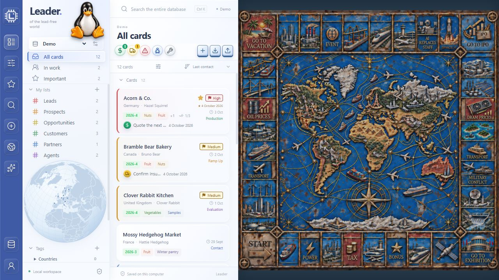

# Leader

**of the lead-free world**

Leader turns a database of companies into a practical workspace for relationships and follow-up. Keep the people you know, what you have discussed and what to do next beside each company, so useful context is easy to find when you need it.

Use it for business development and sales, partnerships, supplier research or a personal job search. For BD and sales, it helps you track qualification, evaluation and production conversations. For a job search, it keeps employers, recruiters, discussions and next steps together. The interface uses commercial labels, but the underlying company cards and contacts support many kinds of company research and relationship management.

Leader runs locally with an English browser interface, SQLite storage and an optional MCP connector. Explore your company relationships on a globe and keep separate databases for different projects.

**All company databases are local.** Leader does not upload database contents to the Internet or external servers. The browser connects to the service on the same computer; SQLite databases and automatic backups remain local. Only the fictional woodland Demo is included in this repository. Exports and optional MCP access are under your control; an assistant connected through MCP can receive the data its authorized tools return.

**Single-user by design.** There will be no multi-user collaboration edition. *A leader walks ahead alone - that's what makes a leader.*

**[User manual](docs/USER_MANUAL.md)** · **[PDF manual](public/Leader-User-Manual-1.0.0.pdf)** · **[Documentation index](docs/README.md)**

## What it does

- Six permanent lists: **Leads → Prospects → Opportunities → Customers → Partners → Agents**, with spectrum colors and optional sidebar visibility.
- Five independent project stages: **Contact → Evaluation → Ramp Up → Production → Legacy**. Priority supports sorting, filters and visible row markers.
- Company cards with multiple contacts, contact statuses, factual summaries, checklists and participant-linked history.
- Autosave on leaving a card or losing browser focus. **Undo** discards the current unsaved card draft.
- Five attention flags with dated on/off history and comments; toggling them in the UI updates Last contact.
- Search across a company database, filtered geography and automatic contact-quarter tags, including future years.
- Agent/partner relationships, portable list transfers, complete company exports and automatic local backups.
- Personal settings, a square background map and 60 finished collectible game pieces.

Each connected company has a separate database. A fresh checkout supplies only the woodland Demo: twelve fictional animal-run companies buying nuts, vegetables and fruit, with reserved .example contact addresses. Your customer cards are transferred separately.



## Quick start

Install **Node.js 24 or newer** and the **pnpm version declared in package.json**. From a terminal:

```sh
git clone https://github.com/Ben-Pin/Leader.git
cd Leader
pnpm install --frozen-lockfile
pnpm build
pnpm start
```

Open **[http://127.0.0.1:4177/](http://127.0.0.1:4177/)** on the same computer and keep the terminal running. Stop the foreground server with Ctrl+C.

On Windows, after installation and the first build, `start-leader.cmd` starts Leader in the background and opens the browser. Other systems can use the commands above. Windows browser operation is verified; Linux, including ARM64, and macOS need a compatible Node.js runtime and have not been verified on physical machines for this release.

## Your data and another computer

GitHub stores source, documentation and artwork. Customer databases, exports, mail archives and private import reports stay outside version control.

To move one database, use **Company databases → Export**, start Leader on the new computer, then choose **Connect from Leader JSON file → Import and connect**. This creates a new database rather than overwriting an existing one. See [transfer and recovery](docs/USER_MANUAL.md#move-to-another-computer-and-recover-data) for full steps and the separate browser-preference limitations.

Standard server startup creates JSON backups under `data/backups/<company-id>/`, repeats every six hours while running, and retains the newest 28 per connected company. Copy important backups to separate storage.

## Development

```sh
pnpm dev
pnpm build
node --test --test-concurrency=1 tests/*.test.mjs
```

The development UI uses the address printed by Vite and proxies the local API. Production runs at port 4177. [Contributing](CONTRIBUTING.md) describes safe test databases and source-only commits.

## Current scope

Leader 1.0.0 is a single-user local web application. The server binds to loopback; it is not a public website or a cloud service. There is no live cloud sync, built-in PST/mail/TickTick importer, email sending, reminder scheduler, or attachment manager. Wisdom has a setting but no connected thought-card source. The local MCP implementation is included; installation into a host is a separate step.

See [Product](docs/PRODUCT.md), [Architecture](docs/ARCHITECTURE.md), [API](docs/API.md), [MCP connector](docs/CONNECTOR.md) and [Verification](docs/VERIFICATION.md).

## Credits

Concept and Product: **Benjamin Pinkas**. Development with OpenAI Codex.
