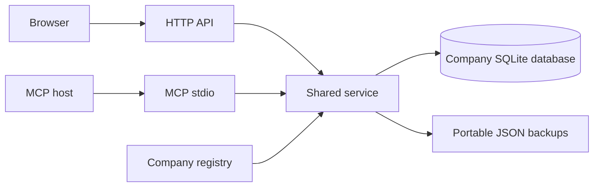

# Leader architecture

Current implementation: Leader 1.0.0. Browser and MCP mutations share validation, optimistic revisions and SQLite transactions.

## Components

| Layer | Implementation |
| --- | --- |
| Browser | React/TypeScript, Vite, local assets, English labels |
| HTTP | Node.js 24+, Express, built UI and JSON API on 127.0.0.1:4177 |
| Service | server/store.mjs: validation, collections, queries, revisions, transactions |
| Storage | Node built-in SQLite, WAL, foreign keys, indexed queries |
| Company registry | server/companies.mjs: explicit company selection and independent stores |
| Backups | server/backups.mjs: verified JSON snapshots and retention |
| MCP | server/mcp.mjs: local stdio transport through the same service |

## Company isolation and files

Default storage is data/ beside this checkout: companies.sqlite is the registry, leader.sqlite is the legacy Demo store, and companies/ contains additional databases. A fresh registry connects Demo and empty additional workspaces; their customer content is never seeded from private correspondence.

HTTP selects a database with X-Leader-Company. MCP requires companyId on scoped tools in multi-company mode. There is no global server-side active company. Disconnect updates the registry and closes its store without deleting files; reconnect reuses those files. The last connected database is protected.

LEADER_DATA_DIR sets an alternate registry/data directory. LEADER_DB (or LEADER_DB_PATH) enables legacy single-database mode, bypassing company management and the automatic backup scheduler. LEADER_SEED=false disables fictional demo seeding in a fresh store. Use the same absolute directory/path for HTTP and MCP, especially if an MCP host copies the plugin into a cache.

## Model and migrations

Tables include cards, lists, tags, card_tags, checklist_items, activity, card_flags and card_distributors. Stable IDs identify cards, contacts and activity. Contacts are validated JSON; legacy primary name/email mirror the first contact. Activity retains contact snapshots and kinds note/flag/list. Card completed remains for portable compatibility; current work views use independent flags.

Schema migrations run transactionally when a store opens. Schema v12 expands account categories/stages while preserving the referenced cards table and its foreign keys. Legacy raw account/stage columns remain; old lead/contacted/client stages normalize to Contact and qualified/proposal to Evaluation. Customer membership does not establish Production.

Company initialization ensures the six permanent lists and order. Distributors becomes Agents with the ID retained. Duplicate legacy aliases are reconciled without invented list-transition history. Ordinary saved category/list moves do create History; explicit draft sequences retain intermediate moves and must end at the resolved saved list.

PATCH and addComment require the current version. Stale writes fail with 409. Card/collection changes and event validation share one transaction, so partial failures roll back. Providing contacts replaces the collection; omitting it preserves contacts. History participants must belong to the card at write time. Archive is reversible by ID; there is no permanent card-delete operation.

## Queries and geography

Default page size is 100, maximum 200. Counts, filters and text search run server-side; the browser does not fetch every card to render one page. Search covers text fields, contacts, flag comments and tag names. The browser's global text search overrides its sidebar scope while retaining Stage/Priority filters.

Cards and geography share one filter builder. Country aggregation covers all matching rows, independent of pagination, and avoids duplicate counting when both country fields are equal. The UI ignores stale responses and aborts obsolete geography/directory requests. Country-point distribution is visual, not geocoding. Projection animation uses requestAnimationFrame and memoized geometry.

## Portable formats and backups

leader-company v1 includes lists, custom tags, all cards including archived, IDs, versions, dates, contacts, flags, checklists, participant snapshots and relationship links. Import builds a new database atomically; existing companies are not overwritten. HTTP input limit is 128 MB, company package maximum is 100,000 cards. Links are restored after endpoints exist.

leader-list v1 supports up to 10,000 records. Import remaps tags by name, skips existing IDs, and either preserves categories or applies a target permanent list. Missing external endpoints are omitted and counted. New records carry imported_pending until their first saved edit. Export privacy switches only clear description/activity in the exported copy, not current flag comments.

Standard multi-company HTTP startup writes a verified JSON snapshot of each connected database, then repeats every six hours while running. Writes use a temporary file and rename; retention keeps 28 snapshots per company. These are local recovery files, not off-device backups. MCP alone and explicit single-database startup do not run this scheduler.

## Browser preferences and assets

Display name, motto, Wisdom, map visibility, hidden lists and game-piece selection use browser localStorage. Custom map Blobs use IndexedDB; temporary object URLs are revoked on replacement. Preferences are scoped to a browser profile/origin and excluded from company JSON. The map is square, contain-sized and 70% opaque. Game pieces are finished transparent PNGs; asset generation is a separate one-time process.

Draft fields autosave when leaving a card/company or on browser focus loss/visibility change. Undo discards unsaved fields/events; it cannot undo committed writes. Notes save explicitly. UI flag toggles set the local contact date; the raw API does not infer a contact date merely from a flag PATCH.

## Local security and deployment

HTTP binds loopback, validates Host, checks same Origin and a bootstrap session token for writes, and requires explicit company scope. This is a local single-user boundary, not a remote authentication system. No remote font/CDN asset is needed for normal UI operation. Dependencies must be installed before offline use.

The source includes portable plugin metadata and a Codex compatibility overlay. Host installation is separate; MCP stdout is reserved for protocol messages. No HTTPS MCP endpoint, public hosting, cloud sync or outgoing email is provided. Windows is locally verified; Linux/ARM64 and macOS are unverified deployment targets.
