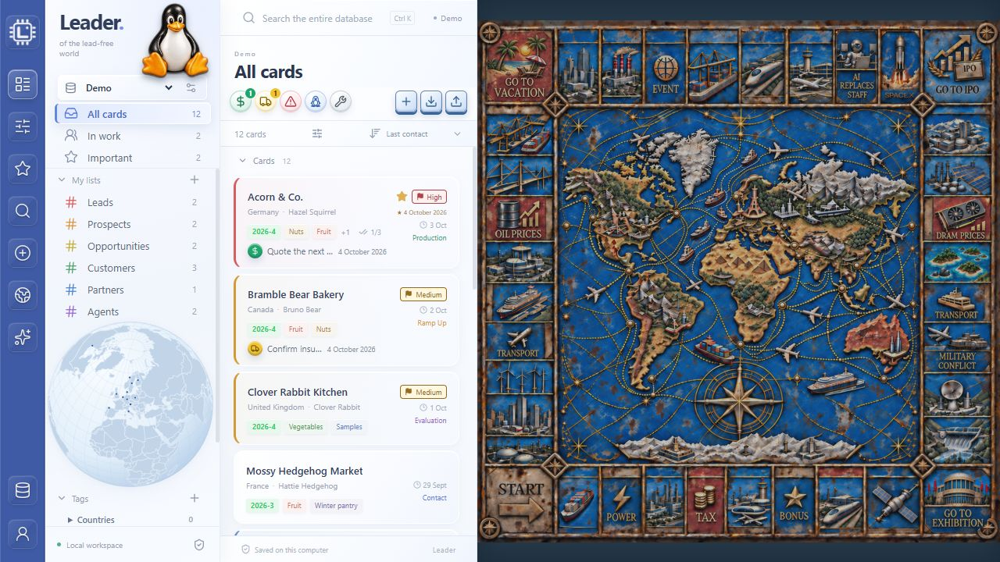
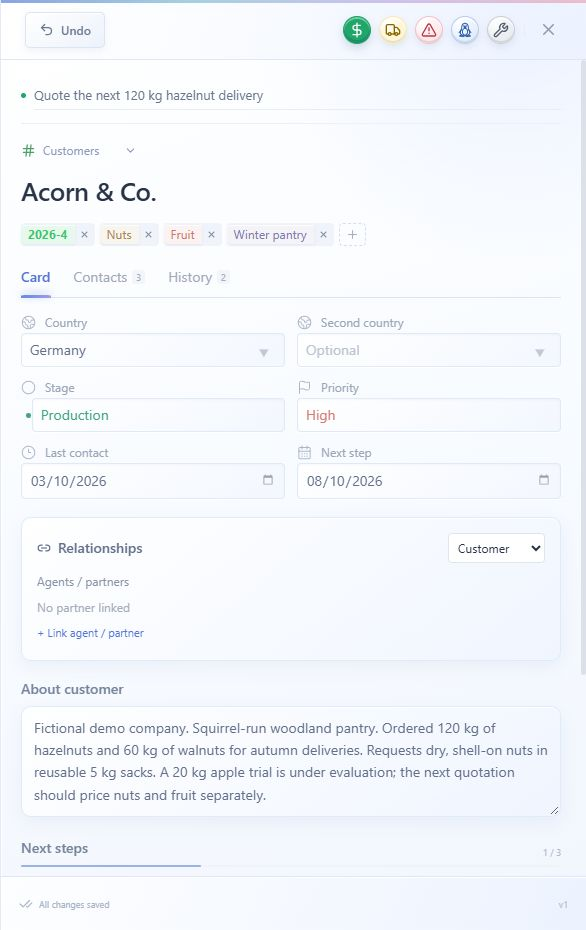
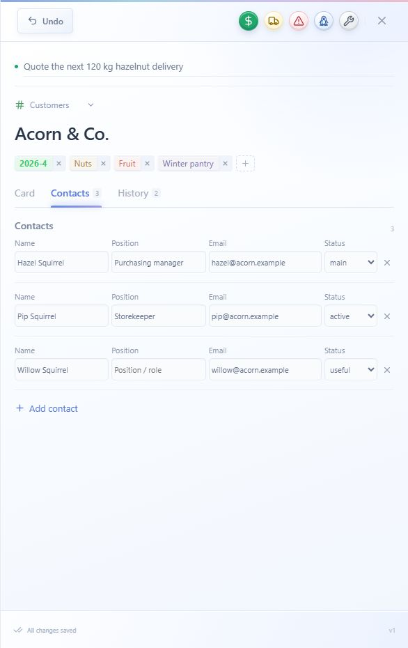
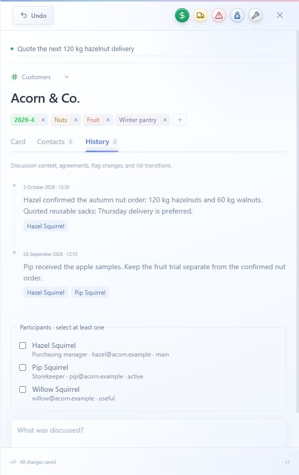
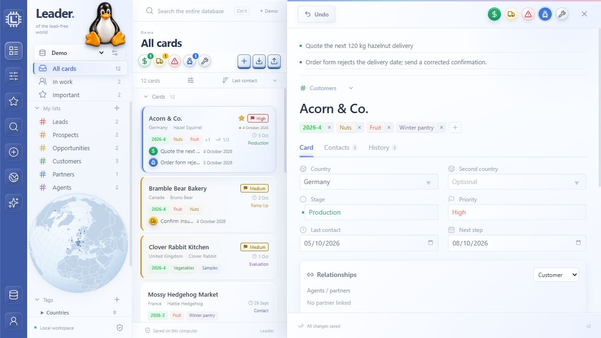
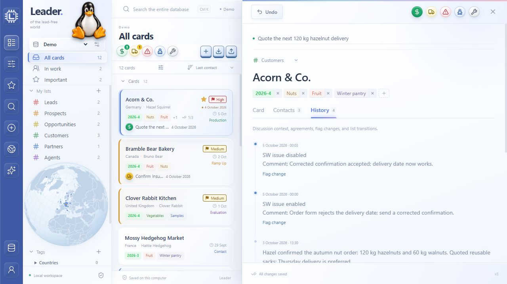
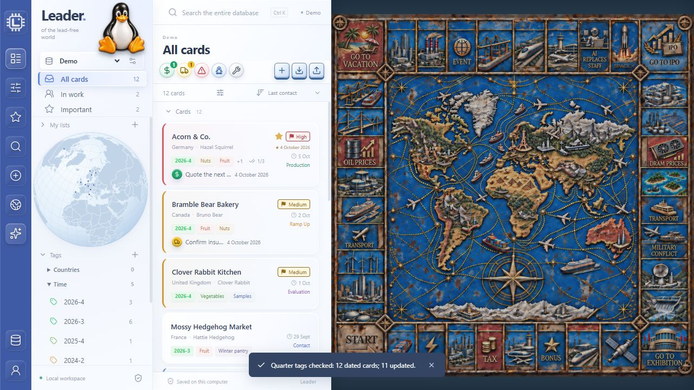
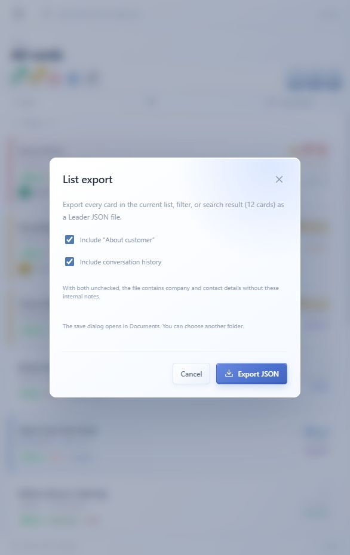
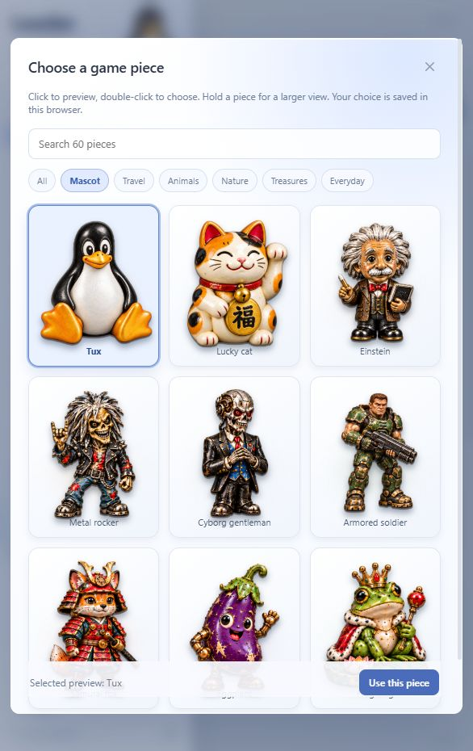

# Leader user manual

For Leader 1.0.0. [All documentation](README.md)

## A workspace for company relationships

Leader turns a database of companies into a practical workspace for relationships and follow-up. Keep the people you know, what you have discussed and what to do next beside each company, so useful context is easy to find when you need it.

Use it for business development and sales, partnerships, supplier research or a personal job search. For BD and sales, it helps you track qualification, evaluation and production conversations. For a job search, it keeps employers, recruiters, discussions and next steps together. The interface uses commercial labels, but the underlying company cards and contacts support many kinds of company research and relationship management.

**All company databases are local.** Cards, contacts, discussions and backups are stored as files on your computer. Leader does not upload their contents to the Internet or to external servers. Its browser communicates only with the Leader service on the same computer; there is no cloud database, telemetry upload or automatic external synchronization.

**Single-user by design.** There will be no multi-user collaboration edition. *A leader walks ahead alone - that's what makes a leader.*

Local storage keeps database contents under your control. If you choose to export a file, share it or connect MCP to an assistant, that is a separate action: an MCP host can receive card data through the tools you authorize. A cloud assistant may process that data on its provider's servers. Leave MCP disconnected if no external assistant should receive database information.

Company cards, multiple contacts, dated discussion history, tags, geography and next steps provide the working context; lists, Stage and Priority help you decide where to focus.

Open **About Leader → Open user manual (PDF)** for this bundled English guide. It opens from the local server and does not need an online document viewer.

About shows the application version, **Concept and Product: Benjamin Pinkas**, and a large random game piece on each opening.

## Install and open Leader

You need Git, Node.js 24 or newer, pnpm matching `package.json`, and a modern browser. The source repository is public; no GitHub sign-in is needed to clone it. Dependencies are installed once; normal use then runs locally.

```sh
git clone https://github.com/Ben-Pin/Leader.git
cd Leader
pnpm install --frozen-lockfile
pnpm build
pnpm start
```

Open **http://127.0.0.1:4177/** on the computer running Leader. Keep the terminal open; Ctrl+C stops that foreground server. On Windows, `start-leader.cmd` can start the built application in the background and open the browser. Closing that browser tab does not stop a background server.

Windows has been tested. Linux/ARM64 and macOS are intended to use the same Node/browser workflow, but this release has no physical-machine verification for those platforms. The Windows `.cmd` launcher is optional and is not used on Linux.

A new checkout contains a fictional woodland Demo: animal-run companies buying nuts, vegetables and fruit. Examples use reserved .example email addresses. It does not download your customer database from GitHub. Select a database in **Connected company** in the sidebar, or use **Company databases** to create/import one.

## Find your way around


The blue rail contains the application shortcuts shown below. Hover an icon to read its label. On narrow screens, the rail is hidden and **Lists and tags** opens the navigation sidebar.

The sidebar holds the company selector, lists, grouped tags and globe. The central column shows cards and Add card, List import and List export. Selecting a card opens its details on the right; the tabs are **Card → Contacts → History**.

**All cards** includes every non-archived card in the selected database. **In work** means at least one attention flag is active. **Important** shows starred cards. These are views, not extra copies of cards.

**Database versus list:** the company selector chooses an independent database, such as Demo. Leads through Agents are account lists inside that database. Toolbar views never search or combine other connected databases.

## The blue toolbar, icon by icon



| Icon / position | Action | What happens |
| --- | --- | --- |
| 1. White chip logo | About Leader | Shows version, product credit and a random game piece. Open the local PDF manual here. |
| 2. List outline | All cards | Opens all non-archived cards in the connected database. Clears text search; Stage and Priority filters remain. |
| 3. Sliders | In work | Shows cards with at least one active colored flag. This is independent of their list and Stage. |
| 4. Star | Important | Shows starred cards. A star is independent of Priority; setting High priority does not add a star. |
| 5. Magnifying glass | Search cards | Focuses the search box. Type to search the selected database; Ctrl+K / Cmd+K does the same. |
| 6. Circled plus | New card | Opens the creation dialog. Starts in the selected list, or Leads when a view/tag is selected; you can change it. |
| 7. Globe | Customer globe | Opens a larger globe and country directory for the current results, including search and Stage/Priority filters. |
| 8. Sparkles | Auto-tag | Synchronizes contact quarters across the selected database. Uses Last contact, including future years; see the algorithm below. |
| 9. Database cylinder, bottom | Company databases | Create/connect, import/export or disconnect/reconnect separate databases. This manages databases, not account lists. |
| 10. Person, bottom | User settings | Edit the local profile, Leader's motto, visible permanent lists and background map, then Save settings. |

**Navigation and drafts:** All cards, In work and Important save a pending card draft before switching views and clear text search. New card, Auto-tag, Company databases and User settings also save pending card edits before proceeding. If validation or a revision conflict prevents saving, resolve that error first. Search focuses the box, and the globe opens a view of the current results.

## Lists, Stage and Priority

The permanent lists describe the account relationship:

| List | Suggested use | Color |
| --- | --- | --- |
| Leads | New, minimally qualified accounts | Red |
| Prospects | Potential customers; relationship not yet confirmed | Orange |
| Opportunities | Accounts with an identified commercial opportunity | Yellow |
| Customers | Confirmed buying customers | Green |
| Partners | Companies collaborating with you | Blue |
| Agents | Resellers/distributors supplying other companies | Violet |

Choose **Card list** or **Account type** to move a card. Account type and its corresponding permanent list stay aligned. Each saved move records the date and source/destination in History, including intermediate draft moves. This is not automatic qualification: a forecast or a price request alone does not prove a purchase.

All six permanent lists are protected from deletion. Hide selected lists under **User settings → Visible permanent lists**; hiding does not remove records. Custom lists can be created, and empty custom lists can be deleted using **Delete list**. Move their cards elsewhere first.

**Stage** is independent of the list: **Contact → Evaluation → Ramp Up → Production → Legacy**. Choose the negotiation/project step in Card. Changing Stage does not move the card.

**Priority** is No priority, Low, Medium or High. A set priority appears beside the star with a colored left accent. Open **Filter cards** for Stage/Priority filters, or choose **Priority: high first** in sorting. Star is a separate Important marker. Stage remains beneath the contact date on a card row.

## Create, edit, save and undo




1. Select a company database and click **Add card** or **New card**.
2. Enter **Company or name**, a list, and any known country/contact date. Use a readable company name rather than its domain.
3. Click **Create card**, then fill the Card, Contacts and History tabs as needed.

Card fields include primary/second country, Stage, Priority, Last contact, Next step date, About customer, partner links and a Next steps checklist. Enter a second country only when it is meaningful for the account; the globe counts each distinct country.

Draft card fields save when you close or leave the card, switch company, or the browser window loses focus/becomes hidden. **Ctrl+S** (Cmd+S on macOS) saves explicitly. Wait for **All changes saved** in the footer before stopping the server. A save error remains visible and preserves the draft.

**Undo** discards the current unsaved card edits and closes the card. It does not roll back edits already saved through focus loss, an earlier save, or **Add note**. An unsubmitted note is not a saved History entry. Browser-tab closing may show the browser's native unsaved-change warning; do not rely on forced tab/process closure to finish a save.

If another window or MCP operation changes the same card, Leader rejects the stale revision. Copy your intended changes, refresh/read the latest card and reconcile them rather than overwriting it blindly.

## Contacts and discussion history




Open **Contacts** and add one row per contact: **Name, Position, Email, Status**. Up to 100 contacts are supported. Use a valid email when known; unknown fields may stay blank. **Position/Role stays empty unless the role is known**. Empty rows are omitted on save.

| Status | Meaning |
| --- | --- |
| active | Default current contact |
| main | Primary point of contact |
| inactive | No longer active / left the company |
| disturbing | Contact requiring special handling |
| useful | Helpful contact |
| decisions | Decision-making contact |



In **History**, select at least one contact, write what was discussed and click **Add note**. This saves pending card edits first and then immediately records the note. Notes keep participant snapshots, so later removal or editing of a contact does not erase attribution. Older imported history can appear as **Older entry without contacts**. System flag/list events do not require participants.

Keep **About customer** as a concise factual summary of requirements, constraints and agreements. Keep dated conversations in History. For historical correspondence, include its actual date in the text: a newly added note has today's creation timestamp. Adding a note does not itself change Last contact; set that date explicitly when needed.

## The five attention flags

The round controls in the card header are independent:

| Color / symbol | Flag | Use |
| --- | --- | --- |
| Green / dollar | In quote | Pricing response or quotation follow-up |
| Yellow / truck | Logistics issue | Delivery, stock or shipment concern |
| Red / warning | Administrative issue | Paperwork, payment or account issue |
| Blue / Tux | SW issue | Software problem |
| Gray / wrench | HW issue | Hardware problem |



**Open an issue:** open the company card, turn on the relevant colored button in its header, then enter a short comment in the matching colored row below. Each active flag has its own single-line field, limited to 300 characters. Describe the specific problem or next action, for example: **Order form rejects the delivery date; send a corrected confirmation.** Leave the card or press Ctrl+S / Cmd+S to save.

**Close an issue:** while the flag is still on, replace its comment with the resolution, for example: **Corrected confirmation accepted; delivery date now works.** Then turn that flag off and save. The field disappears when the flag is off, so enter the resolution before switching it off. The last comment is retained and appears again if you re-enable the flag.



Every saved on/off transition adds a **Flag change** entry in History with the flag name, enabled/disabled state, timestamp and comment. Disabling does not erase the earlier enabled entry. System flag events need no contact participant. Editing a comment alone updates the current flag text without creating another on/off event; use a participant-linked History note for a fuller discussion.

In the browser UI, **both turning a flag on and turning it off set Last contact to today's local date** and update the draft quarter accordingly. Typing in the comment field alone does not change Last contact. These edits follow normal card autosave; Undo discards unsaved toggles/comments and does not undo previously saved events.

The matching central-column colored buttons are **filters**. Click one to view cards with that active flag; click it again to return to All cards. Their badges count saved matching accounts across the selected database. Filtering does not toggle a card's flag, write a comment or change Last contact. Clear text search to use the selected flag view; a nonempty global search overrides sidebar/flag scope. Several flags can be active on one card, but **In work** counts that card once. A card leaves In work when all its flags are off; it stays in its account list.

## Search, tags and the globe

**Ctrl+K** (Cmd+K) focuses Search. Text search covers the whole selected company database, including company/card names, countries, contact names/roles/emails, About customer, flag comments and custom tag names. It overrides the selected sidebar list/tag/flag view; Stage and Priority filters still apply. Clear Search to return to the sidebar selection. History-note text and checklist text are not part of this search.

Custom tags are grouped into **Countries, Time, Product, Stage, Application, Other**. Choose Group when creating a tag. To move an existing tag, select it in the sidebar and change **Tag group** above the result list. **Delete tag** removes the tag and its assignments without deleting cards.

Contact-quarter tags are automatic, appear first, and use `YYYY-Q`, for example **2027-1**. They are shown under **Tags → Time**, separately from ordinary editable tags. Removing a card's quarter badge clears its draft contact date and fallback quarter. The Auto-tag section explains how quarters are calculated and synchronized.

The globe follows the current result, including search and Stage/Priority filters, across every result page. Click a country marker to open its matching directory. Country dots are spread within the country for readability; they are not verified office coordinates. Missing/unrecognized countries are not plotted. Drag to rotate; card/country selection rotates smoothly. Reduced-motion browser preferences reduce animation.

## Auto-tag: synchronize contact quarters



Use the **sparkles button** on the blue toolbar after correcting or importing Last contact dates. It is a manual command, not a scheduled job. Normal card rendering already derives the visible quarter from Last contact, so a badge can be correct before a run; Auto-tag makes the stored fallback quarter agree with that date.

The algorithm is:

1. **Select one database.** Auto-tag uses the database in Connected company. It saves any pending card edits first; a save error stops the operation.
2. **Find dated cards.** The current server examines every card with an exact Last contact date in that database, across all lists, including archived cards. The current list, search and Stage/Priority filters do not limit the operation.
3. **Calculate the quarter.** Keep the contact date's year and divide its month into the four ranges below: quarter = round up(month / 3). Form the label `YYYY-Q`.
4. **Compare and synchronize.** If the stored contact quarter differs, replace it and advance that card's revision/update timestamp. Already matching cards stay unchanged. Cards without an exact date are skipped; an existing quarter-only fallback is preserved.
5. **Refresh and report.** Reload the selected card, result list and sidebar groups. The notification reports dated cards examined and stored quarters updated. Quarter groups for non-archived cards appear automatically under Time.

| Contact month | Quarter number | Example label |
| --- | --- | --- |
| January through March | 1 | 2027-1 |
| April through June | 2 | 2027-2 |
| July through September | 3 | 2027-3 |
| October through December | 4 | 2027-4 |

**There is no fixed list of years to maintain.** A contact dated 8 February 2027 produces **2027-1** automatically; 1 April 2027 produces **2027-2**. Future years use the same calculation. These quarter groups are derived from card data, rather than created as ordinary custom tags.

**Missing or conflicting dates:** 9 April 2026 plus an old stored quarter of 2025-4 becomes **2026-2**. An undated card with only an imported quarter of 2023-2 keeps **2023-2** and gains no invented day. An undated card with no fallback remains untagged. Archived cards are synchronized but are not shown in ordinary card results or Time group counts.

**Read the result:** the pictured run checked **12 dated cards** and updated **11** stored quarters. Running it again without changing any dates reported **0 updated**. Auto-tag does not mark a new contact, change Last contact, move accounts between lists, edit custom tags or create a History event. Undo on a card does not reverse this completed database operation; correct the date and rerun if necessary.

## List import and export




The central-column **down arrow** is **List import**; the **up arrow** is **List export**. List transfers use Leader list JSON, not CSV, PST or a full company snapshot.

For export, select the desired list/view or search and filters, then click List export. Every matching page is included, not only the currently loaded rows. Independently choose whether to include **About customer** and **conversation history**; both are on by default. Excluding them clears those sections in the exported copy only. Current flags, their comments and structured company/contact fields are still included.

Compatible browsers ask where to save and initially suggest Documents. Other browsers use their configured download destination; enable their “ask where to save” setting if needed. Both list and full company export filenames end in local `ddmmhh-hhmm`, for example `051018-1823` on 5 October at 18:23. Full company export opens the same save dialog in compatible browsers; other browsers use their download settings.

For import, choose a Leader list JSON file and a mode:

- **Use each card's category**: route it to the corresponding permanent list.
- **Set every card's category from one target list**: choose the destination and update the imported category to match.

Existing card IDs are skipped, not updated or merged. Equal names with different IDs can still create duplicates. New imported cards show **Imported** until their first saved edit. Valid available agent links are restored; unavailable links are reported as omitted. A failed validation rolls back the list import.

## Company databases, agents and partners

**Company databases** creates an empty database, exports the selected database with a timestamped filename, or imports a complete **Leader company JSON** into a new separate database. Use a new company name when one already exists; imports do not replace existing data.

Removing a database from the connected list preserves its files. Open **Disconnected databases → Reconnect** to bring it back. The last connected database cannot be disconnected.

On Card, **+ Link agent / partner** searches existing partner/agent cards in the same database. Select the relationship; linked accounts appear in the partner's **Clients** section. Unlink removes the relationship only. Self-links and cycles are rejected. Cards with linked clients must have those links removed before changing to a non-partner category.

## User settings and game pieces

Open **User settings** at the bottom of the blue rail. Change the display name, **Leader's motto**, visible lists and background map, then click **Save settings**. The default motto is **of the lead-free world**. The profile name is a local preference, not a login.

The background appears only while no card is open. Choose the built-in map, disable it, or load a square **PNG/JPEG/WebP** up to **20 MB** and **8192 × 8192** pixels. Its 1:1 ratio is preserved; it displays at 70% opacity (30% transparent).



Click the selected figurine beside Leader to open the gallery of 60 finished pieces. It starts in **Mascot**; use categories/search to find others. Click to preview; double-click or **Use this piece** to select. Holding a figure for about 350 ms enlarges it in place with a slight slow wobble; release returns it to position.

Appearance preferences and the selected piece are stored in this browser profile; custom maps use browser storage. Company JSON backups do not contain these settings.

## Software stack

Leader is a local browser application: the browser renders the interface, a Node.js process serves it on loopback, and SQLite stores each company database on disk. It does not require a hosted database or cloud service for normal operation.

| Technology | Role in Leader |
| --- | --- |
| React 19 and TypeScript 5 | Component-based interface and typed card, contact and preference models |
| Vite 8 | Development tooling and production browser build |
| CSS, SVG and transparent PNG assets | Compact panels, glass/relief effects, transitions, the map and game pieces |
| Lucide React | Consistent interface icons; the supplied Leader logo is a separate image |
| D3 Geo, TopoJSON Client and World Atlas | Globe projection and country geometry |
| Node.js 24+ and Express 5 | Local HTTP server and JSON API at 127.0.0.1:4177 |
| SQLite via Node's built-in node:sqlite | Persistent company records, indexed queries, transactions and revision checks |
| Zod and Model Context Protocol SDK | MCP input schemas and the optional local stdio assistant connector |
| localStorage and IndexedDB | Browser preferences, selected piece and custom-map storage |
| pnpm and Node's test runner | Dependency management and automated verification |
| Python, ReportLab and Pillow | Authoring the bundled illustrated PDF; Python is not needed to run Leader |

Browser and MCP edits use the same data service. Portable company/list JSON files transfer records; they are not the live database. Exact dependency versions are pinned in the repository lockfile. The technology list describes this release, not a requirement to install every framework separately: pnpm installs the application dependencies.

## Game piece personalities

Each piece has a playful character and its own kind of good fortune. These invented strengths and lucky associations are stories; choosing a piece does not change records, priorities or results. The PDF includes an illustrated collection of all 60 pieces. See the [separate catalogue](GAME_PIECE_PERSONALITIES.md) for the same collection on GitHub.

## Move to another computer and recover data

1. In the old installation, choose the company and **Company databases → Export**. Wait for the file to finish downloading.
2. Install/build/start Leader on the new computer and open `http://127.0.0.1:4177/` there.
3. Choose **Company databases → Connect from Leader JSON file**, select the export, check the company name, then **Import and connect**.
4. Switch to the imported company and verify cards, contacts and History. Repeat for other companies.

For an exact filesystem transfer of the registry and every database, stop Leader and any MCP processes using those files on both computers, then copy the entire **data/** directory into the new checkout before restarting. Never copy a live SQLite database/WAL pair as an ordinary file backup. Browser settings/custom maps must be configured again in the new browser profile.

The standard multi-company server makes verified JSON snapshots at startup and every six hours while running, retaining the newest 28 per connected company under **data/backups/<company-id>/**. Copy important snapshots to another disk. Automatic snapshots are not produced while the app is stopped or in explicit single-database mode.

To recover a snapshot, use **Connect from Leader JSON file** and import it under a new company name. Inspect it before switching to the recovered copy. Git clone alone restores code/artwork, not customer data. External assistant mail analysis is separate from Leader's built-in JSON importer.

## Update and troubleshoot

The release baseline is **1.0.0**. New or changed functionality advances the minor version (for example, 1.1.0); fixes and documentation-only releases advance the patch version. Breaking compatibility changes advance the major version.

Before updating, save drafts and export important databases. Stop Leader and any MCP process using the checkout, then run:

```sh
git pull --ff-only
pnpm install --frozen-lockfile
pnpm build
pnpm start
```

| Problem | What to check |
| --- | --- |
| Browser cannot connect | Start the server; use the printed address on the same computer |
| Port 4177 is occupied | Stop the earlier instance; a second server cannot use the same port |
| Server runs but the UI is missing | Run `pnpm build` before `pnpm start` |
| Session expired after restart | Reload once the previous draft is saved or copied |
| A card seems missing | Check the company, clear search/filters, show hidden lists; archived cards need restoration by ID through MCP/API |
| External MCP changes are not visible | Refresh the browser after saving the current draft; there is no live push |
| Cannot add a note | Add a contact and select at least one participant |
| Cannot delete a list | Permanent lists are protected; custom lists must be empty |
| Cannot change a tag group | Select a custom tag; derived contact quarters have no editable group |
| Export does not ask for a folder | Browser lacks the save-picker API; configure its download settings |
| Import rejects a file | Match list JSON with List import, or company JSON with Company databases |
| Launcher fails on Windows | Check `data/server.log` and that dependencies/build are present |

Leader currently has no in-app archive browser/restore control, scheduled reminders, attachment storage, outgoing email or cloud synchronization. Use the [MCP connector](CONNECTOR.md) for supported assistant operations; installing that connector is separate from opening Leader in a browser.
